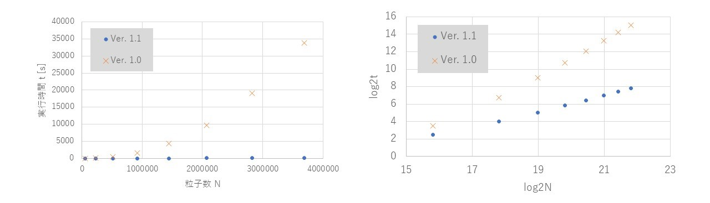

# 各バージョンの性能
各バージョンにおける機能、実行規模、実行速度などの記録

## Ver. 1.0
- 東京大学物性研スパコンシステムBにおいて、128プロセスx16ノードの実行確認済み。粒子数2500万。
- 手元のノートPC（Intel Core i5-10210U）にて、4プロセス、4万粒子の一様配置生成から5000 stepのシミュレーション。1486秒。

## Ver. 1.1
- メッシュ探索によるペアリスト構築を実装。これにより、大規模実行が高速化された。
- 手元のノートPC（Intel Core i5-10210U）にて、4プロセス、4万粒子の一様配置生成から5000 stepのシミュレーションが198秒となり、Ver. 1.0とくらべて約7.5倍高速化された。

なお、プロセス数を増やすとファイル出力が混み合い、シミュレーションが遅くなってしまうので、～64プロセスくらいまでで収めた方が良い。

## Ver. 1.2
- ロードバランサーを実装した。Global Sort法（1番）およびVoronoi法（2番）が利用可能となった。[使い方](../README.md/#使い方usage)も合わせて更新。

## Ver. 1.3
- .cdvファイルを分割出力にした。以前のバージョンでは全プロセスが同一ファイルを同じタイミングで触りに行くため、これがボトルネックとなっていた。本バージョンからは、プロセスごとに一時ファイルを出力し、それをルートプロセスが結合する方式をとっている。これに伴い、一時ファイル`.temp`が大量に吐かれるが、シミュレーション完了時にはすでに必要ないものである。C++の`filesystem`に対応していれば、これらも自動で削除する。
- シミュレーションのチェックポイント自動保存機能を追加した。これも上記の`.cdvファイル`と同じ仕組みで出力する。`1.ckpt`もしくは`2.ckpt`へ交互に上書きしていくため、どちらかが最新版となる。
- 各ステップの実行時間計測機能を追加した。
- 各ステップのロードバランス計測機能を追加した。
- シミュレーション時間計測のため、何回か連続して同一のシミュレーションを行えるようにした。上記の実行時間またはロードバランス計測結果を試行別に出力する。
- .cdvファイルの番号が4桁に対応した。
- その他リファクタリングを行った。

## Ver. 1.4
- ボロノイ分割に関するバグを修正した。
- ボロノイ分割の動作が若干効率化された。

## Ver. 1.5
- 種々の高速化を行った。
- 400万粒子一様配置、4000ステップのシミュレーションを36プロセスで実行したとき、596秒（Ver. 1.4）から568秒（Ver. 1.5）となり、4～5%くらいは高速化された。なお、ロードバランサーはボロノイ法を使用した。1プロセスあたりの粒子数がもっと多く、ロードバランサーなしであれば、さらに高速化されると考えられる。

## Ver. 1.6
- 通信時間の計測機能を追加した。

## Ver. 1.7
- ロードバランサーの種類を追加した
- 実行時間計測のロードバランサー別試行に対応した
- ボロノイ法のバグを修正した
- リファクタリングを行い、コードが少しきれいになった

## Ver. 1.8
- Skew Boundary法のバグを修正した
- 出力ファイル解析スクリプトを追加した

## Ver. 2.0
- 3次元シミュレーションを追加
- ロードバランサーのデフォルトパラメータを変更
- GS法のメモリ周りを改善
- 可視化スクリプトを修正

## Ver. 2.1
- 稀に不具合を起こすバグを修正
- 可視化スクリプトを修正
